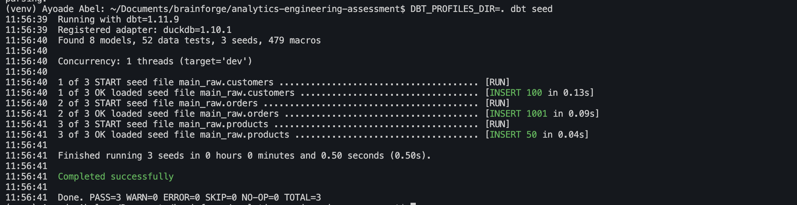

# Analytics Engineering Assessment  - Ayoade Adegbite

A dbt + DuckDB analytics engineering project built to solve a realistic e-commerce data challenge. This repository demonstrates:
- **Data quality handling** through staging, deduplication, and quarantine
- **Incremental modeling** for monthly revenue aggregates
- **Complex business metrics** via cohort analysis
- **Testing and documentation** for warehouse reliability

## What this solution includes

- `models/staging/`
  - `stg_orders__labeled.sql` — parse source orders, deduplicate by `order_id`, and produce `dq_reason`
  - `stg_orders.sql` — clean, trusted sales orders
  - `stg_orders__quarantine.sql` — rejected orders with audit metadata
  - `stg_customers.sql` — normalized customer records, deduped by `customer_id`, flags shared emails
  - `stg_products.sql` — typed product output for downstream use
- `models/intermediate/int_orders_enriched.sql`
  - enriches orders with customer attributes and encodes the revenue-recognition rule once
- `models/marts/fct_monthly_revenue.sql`
  - incremental monthly revenue mart by `country` and `year_month`
- `models/marts/fct_customer_cohorts.sql`
  - cohort analysis chosen as the complex business metric
- `macros/positive_amount.sql`
  - custom generic test for positive revenue values
- `macros/unique_combination.sql`
  - custom generic test for composite uniqueness without adding dbt packages
- `tests/`
  - singular business-rule tests shipped with the challenge

## Key project decisions

### Data quality strategy

- Uses a **split-at-staging** pattern: clean rows flow to `stg_orders`, bad rows flow to `stg_orders__quarantine`
- Keeps bad data observable instead of dropping it silently
- Quarantines invalid dates, future dates, stale dates, duplicate `order_id` rows, and completed orders with invalid amounts
- Allows `pending` orders with null amounts through staging because revenue recognition is handled later
- Flags shared customer emails instead of merging or dropping them

### Intermediate layer

- Encodes `is_revenue_recognizable` in `int_orders_enriched`
- Ensures downstream marts share the same business rule for revenue eligibility
- Uses a `LEFT JOIN` on customers so missing customer metadata does not silently drop revenue

### Incremental mart

- `fct_monthly_revenue` is materialized as `incremental`
- Uses `MERGE` logic by `country` + `year_month`
- Recomputes any touched month in full when source rows update, avoiding stale aggregate bugs
- Stores `last_updated_at` on the mart to make the watermark self-contained

### Complex metric

- Implements **customer cohort analysis** in `fct_customer_cohorts`
- Chooses cohort analysis because the dataset is small and cohort metrics deliver richer signal than noisy 30-day rolling or MoM growth with only a few months of data
- Computes cohort size, active customers by offset, retention rate, revenue, and average order value

### Testing and documentation

- Uses the built-in dbt test framework plus custom generic tests
- Covers:
  - uniqueness and composite uniqueness
  - not-null constraints on business-critical fields
  - accepted values and relationships
  - custom positive-amount assertions
  - singular business-rule tests for completed order amounts and duplicate orders
- Documents model purpose, business assumptions, and the incremental strategy

## How to run

From the project root:

```bash
DBT_PROFILES_DIR=. dbt seed && dbt run && dbt test
```

This uses the local DuckDB profile defined in `profiles.yml` and the seeds in `seeds/`.

## Run individual models

If you want to build or validate a specific model, run it directly after seeding:

```bash
DBT_PROFILES_DIR=. dbt seed
DBT_PROFILES_DIR=. dbt run --models stg_orders
DBT_PROFILES_DIR=. dbt run --models stg_orders__quarantine
DBT_PROFILES_DIR=. dbt run --models stg_customers
DBT_PROFILES_DIR=. dbt run --models stg_products
DBT_PROFILES_DIR=. dbt run --models int_orders_enriched
DBT_PROFILES_DIR=. dbt run --models fct_monthly_revenue
DBT_PROFILES_DIR=. dbt run --models fct_customer_cohorts
```

You can also run by layer:

```bash
DBT_PROFILES_DIR=. dbt run --models staging+
DBT_PROFILES_DIR=. dbt run --models intermediate+
DBT_PROFILES_DIR=. dbt run --models marts+
```

Or test a single model output:

```bash
DBT_PROFILES_DIR=. dbt test --models stg_orders
```

## Seed source diagram



## Repository structure

```
.
├── CHALLENGE.md
├── README.md
├── dbt_project.yml
├── profiles.yml
├── macros/
│   ├── positive_amount.sql
│   └── unique_combination.sql
├── scripts/
│   └── generate_seed_data.py
├── seeds/
│   ├── customers.csv
│   ├── orders.csv
│   └── products.csv
├── models/
│   ├── staging/
│   │   ├── _staging.yml
│   │   ├── stg_customers.sql
│   │   ├── stg_orders.sql
│   │   ├── stg_orders__labeled.sql
│   │   ├── stg_orders__quarantine.sql
│   │   └── stg_products.sql
│   ├── intermediate/
│   │   ├── _intermediate.yml
│   │   └── int_orders_enriched.sql
│   └── marts/
│       ├── _marts.yml
│       ├── fct_monthly_revenue.sql
│       └── fct_customer_cohorts.sql
└── tests/
    ├── test_completed_orders_positive_amount.sql
    └── test_no_duplicate_orders.sql
```

## Notes

- The project is intentionally designed for the seed dataset (~1,000 orders) but documents the next scalability trigger points.
- `vars` in `dbt_project.yml` define the valid `order_date` window, so the model can treat source date anomalies as data quality issues rather than depending on `current_date`.
- The solution avoids extra dbt package dependencies to keep the run experience simple.